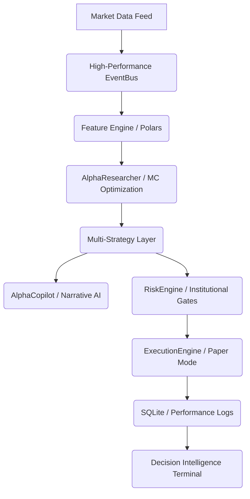

# AlphaNova: Neural Quant & Intelligence Terminal
**Institutional-Grade Quantitative Runtime | Prop-Firm Aesthetic | AI Narrative Engine**

AlphaNova (formerly MiniQS) is a high-performance, event-driven quantitative trading platform built with a focus on institutional-grade resilience, low-latency execution, and agentic intelligence. It combines advanced Python engineering (`uvloop`, `__slots__`, Polars) with a premium Next.js dashboard featuring the **AlphaCopilot Narrative Stream**.

---

## 🚀 Platform Architecture

AlphaNova is built on a strictly decoupled, event-driven architecture designed to minimize jitter and maximize cognitive transparency.



## 🧠 Cognitive Intelligence Layers

### 1. AlphaCopilot (Narrative AI)
AlphaNova doesn't just trade; it explains itself. The `AlphaCopilotStream` provides a real-time narrative of the system's "internal thoughts"—from signal generation to risk-gate rejections—using fluid Framer Motion entry/exit animations.

### 2. AlphaResearcher (Nightly Monte Carlo)
An autonomous agent that periodically runs 5,000+ pass Monte Carlo simulations on historical trade logs to find optimal strategy weights and volatility bounds, which are then hot-swapped into the running engine.

### 3. SentimentSkill
A persistent cognitive agent that monitors unstructured news narrative and converts qualitative data into strict `[-1.0, 1.0]` quant signals for the `EventBus`.

## ⚡ High-Performance Engineering
- **Polars Acceleration**: All feature extraction handles million-row tick windows using Polars' columnar engine.
- **Memory Optimization**: Core data structures use `__slots__` for significant memory and speed efficiency during high-freq loops.
- **Low-Latency Loop**: Utilizes `uvloop` (on Unix) for blazingly fast asynchronous I/O and process orchestration.

---

## 🖥️ The Decision Intelligence Terminal
A "Jane Street" aesthetic dashboard built with:
- **Next.js 15+** & **Tailwind CSS**.
- **Glassmorphic UI**: High-fidelity backdrop filters, linear neon gradients, and layered shadows.
- **Framer Motion**: Micro-interactions for market tick "Pulses" and tactical signal transitions.
- **Live Alpha Curve**: Real-time equity tracking with interactive performance shards.

---

## 🛠️ Setup & Execution

### Pre-requisites
Ensure your `PYTHONPATH` points to the `src` directory to enable the `miniqs` package exports.

```powershell
$env:PYTHONPATH = "C:\Users\tirth\Desktop\Coding\miniqs\src"
```

### 1. Start the Intelligence Hub (Backend)
```powershell
python -m uvicorn decision_terminal.backend.main:app --host 127.0.0.1 --port 8000
```

### 2. Launch the Jane Street Terminal (Frontend)
```powershell
cd decision_terminal/frontend
npm install
npm run dev
```

### 3. Run the Quant Engine (Main Loop)
```powershell
python scripts/run_main.py
```

### 4. Run Strategy Research (Optional)
```powershell
python scripts/run_research.py
```

---

## 🛡️ Risk Controls
AlphaNova implements a multi-stage risk gate architecture:
- **Max Position Limits**: Weighted by asset volatility.
- **Drawdown Kill-Switch**: Automatic halts at the portfolio and strategy levels.
- **Cooldown Logic**: Prevents over-trading during high-volatility spikes.
- **Counterfactual Engine**: Simulates "the trade that didn't happen" for risk-gate transparency.

---
*Built by @TBiswas10 for institutional-grade bot transparency.*
