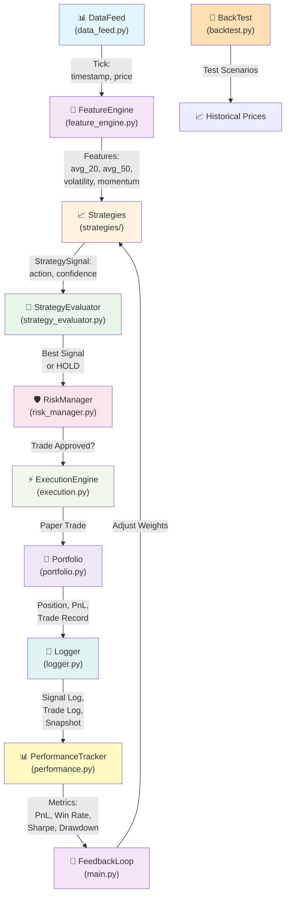
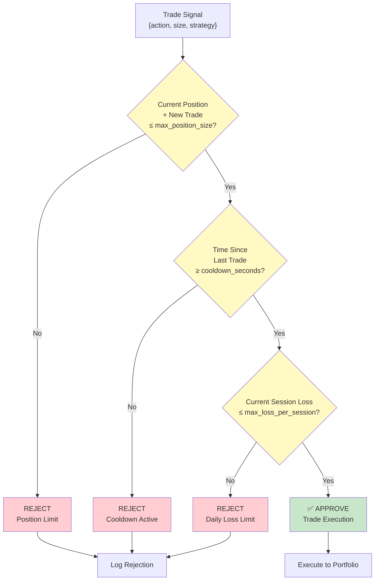
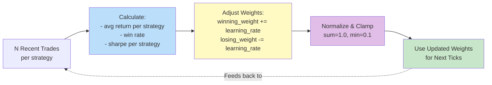
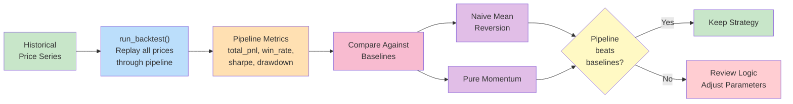
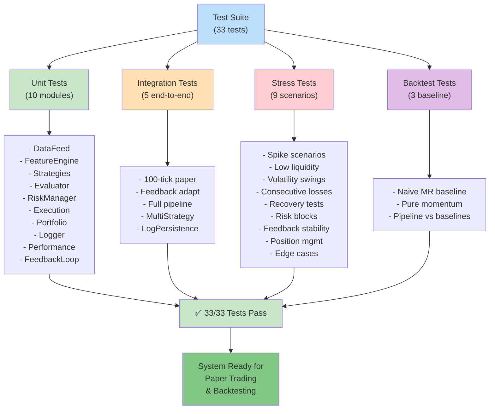

# Mini Quant System – Visual Architecture Blueprint

## 10-Module Pipeline Architecture



---

## Data Flow Diagram

```mermaid
flowchart LR
    Tick["Market Tick<br/>{timestamp, price}"]
    
    Tick --> FE["FeatureEngine<br/>accumulate(tick)"]
    FE --> Features["Rolling Features<br/>{avg_20, avg_50,<br/>volatility, momentum}"]
    
    Features --> MR["MeanReversion<br/>Strategy"]
    Features --> MOM["Momentum<br/>Strategy"]
    
    MR --> Signal1["StrategySignal<br/>action:BUY/SELL/HOLD<br/>confidence"]
    MOM --> Signal2["StrategySignal<br/>action:BUY/SELL/HOLD<br/>confidence"]
    
    Signal1 --> Eval["StrategyEvaluator<br/>max_confidence<br/>filter by threshold"]
    Signal2 --> Eval
    
    Eval --> BestSignal["Best Signal<br/>or None"]
    
    BestSignal --> Risk["RiskManager<br/>check:<br/>- position size<br/>- cooldown<br/>- max loss"]
    
    Risk --> OK{Risk OK?}
    OK -->|Yes| Trade["Create Trade<br/>{action, size, reason}"]
    OK -->|No| Skip["Skip<br/>Log Rejection"]
    
    Trade --> Exec["ExecutionEngine<br/>execute_trade()"]
    Skip --> Log1["Logger.log()<br/>Track rejection"]
    
    Exec --> Port["Portfolio<br/>execute_trade()<br/>update_pnl()"]
    
    Port --> Snapshot["Snapshot<br/>{cash, position,<br/>pnl, timestamp}"]
    
    Snapshot --> Log2["Logger<br/>log_trade()<br/>log_portfolio_snapshot()"]
    
    Log2 --> Perf["PerformanceTracker<br/>record_trade()"]
    
    Perf --> Metrics["Metrics<br/>{total_pnl, win_rate,<br/>max_drawdown, sharpe}"]
    
    Metrics --> Feedback["FeedbackLoop<br/>adjust_weights()<br/>next_tick"]
    
    Feedback -.->|weights for<br/>next iteration| MR
    Feedback -.->|weights for<br/>next iteration| MOM
    
    Log1 --> DB["SQLite Databases<br/>portfolio.db<br/>logs.db"]
    Log2 --> DB
    
    style Tick fill:#c8e6c9
    style Features fill:#bbdefb
    style Signal1 fill:#ffe0b2
    style Signal2 fill:#ffe0b2
    style BestSignal fill:#f8bbd0
    style Risk fill:#dcedc8
    style OK fill:#fff9c4
    style Trade fill:#ffccbc
    style Exec fill:#c5cae9
    style Port fill:#b2dfdb
    style Snapshot fill:#f0f4c3
    style Metrics fill:#d7ccc8
    style Feedback fill:#cfccc8
    style DB fill:#eceff1
```



---

## Module Interface Contracts

### 1. **DataFeed** → **FeatureEngine**
```
Input:  Tick {timestamp: datetime, mid_price: float, volume: float}
Output: Features {rolling_avg_20, rolling_avg_50, volatility, momentum}
```

### 2. **FeatureEngine** → **Strategies**
```
Input:  Features dict {key: value}
Output: StrategySignal {strategy, action: [BUY|SELL|HOLD], confidence: [0,1], reason}
```

### 3. **Strategies** → **StrategyEvaluator**
```
Input:  List[StrategySignal] from multiple strategies
Output: StrategySignal (highest confidence) or None
```

### 4. **StrategyEvaluator** → **RiskManager**
```
Input:  StrategySignal + Portfolio state
Output: (approved: bool, reason: str)
```

### 5. **RiskManager** → **ExecutionEngine**
```
Input:  Trade {side, size, entry_price, timestamp, strategy}
Output: Execution record {trade_id, filled_price, status}
```

### 6. **ExecutionEngine** → **Portfolio**
```
Input:  Trade (approved)
Output: Position update {cash, quantity, avg_entry_price, total_pnl}
```

### 7. **Portfolio** → **Logger + PerformanceTracker**
```
Input:  Portfolio state snapshot {timestamp, cash, quantity, pnl, fees}
Output: Logged data for audit trail and metrics calculation
```

### 8. **PerformanceTracker** → **FeedbackLoop**
```
Input:  Metrics {total_pnl, win_rate, sharpe_ratio, per_strategy stats}
Output: Adjusted strategy weights {mr_weight, mom_weight}
```

### 9. **FeedbackLoop** → **Strategies** (circular)
```
Input:  Performance metrics from all prior trades
Output: Weight updates → influences signal generation for next ticks
```

---

## Risk Management Gate



---

## Feedback Loop Adaptation



---

## Backtesting & Stress Test Scenarios

### Backtest Pipeline


### Stress Test Scenarios
```
1. Price Spike (+5%)        → Quick liquidation, risk limits
2. Price Gap (jump)         → Slippage handling
3. Volatility Swing (2x)    → Feature recalculation
4. Consecutive Losses       → Loss limit enforcement
5. Low Liquidity Spread     → Execution delays
6. Extreme Drawdown (40%)   → Portfolio resilience
7. Recovery Scenario        → Feedback loop stability
8. Position Recovery        → Risk manager re-enabling
9. Feedback Stability       → Weight convergence under stress
```

---

## Testing & Validation



---

## Deployment Checklist

- ✅ All 10 modules implemented and tested
- ✅ Integration pipeline validated (33 tests passing)
- ✅ Stress scenarios passing
- ✅ Risk management gates enforced
- ✅ SQLite logging configured
- ✅ Feedback loop implemented
- ✅ Performance metrics calculated
- ✅ Backtest + baseline comparisons working
- ✅ Paper-only mode enforced
- ✅ Parameter optimization conservative (±5%)

**Status**: 🚀 **Ready for Paper Trading**

---

## Quick Reference

### Key Functions

| Module | Function | Purpose |
|--------|----------|---------|
| data_feed.py | `DataFeed.get_latest_tick()` | Fetch current market price |
| feature_engine.py | `FeatureEngine.update_features(tick)` | Calculate rolling features |
| strategy_*.py | `generate_signal(features)` | Generate BUY/SELL/HOLD signal |
| strategy_evaluator.py | `evaluate_signals(signals, threshold)` | Select best signal |
| risk_manager.py | `check_risk(trade, state)` | Validate trade against rules |
| execution.py | `ExecutionEngine.execute_trade(trade)` | Execute paper trade |
| portfolio.py | `Portfolio.execute_trade(trade)` | Update position & PnL |
| logger.py | `QuantLogger.log_trade(result)` | Persist trade to SQLite |
| performance.py | `PerformanceTracker.compute_metrics()` | Calculate all metrics |
| backtest.py | `run_backtest(prices, config)` | Full pipeline on historical data |
| main.py | `run_paper_trading_session(ticks)` | End-to-end with feedback |

### Configuration Priorities

**Safety**: max_position_size, max_loss_per_session, cooldown_seconds
**Performance**: mr_threshold, mom_threshold, confidence_threshold
**Adaptation**: feedback_learning_rate, feedback_freq

---

For detailed module descriptions and examples, see [README.md](README.md).
